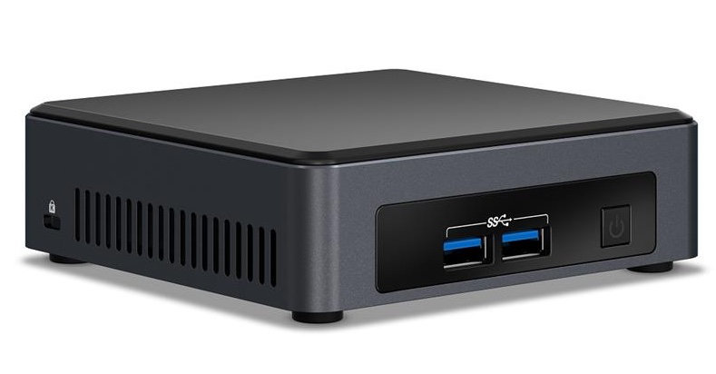

# Project Migit - AI Server on a Potato

## What is this?

I'm writing this guide to help beginners dip their toes into running a local AI server at home. You don't need 8x Mac minis or even a GPU - if you have an old laptop or computer, this guide is for you. The aim is to set up Linux, Ollama, and OpenWebUI on a potato, using only the CPU for inference. In addition to running LLMs, we'll generate images too!

In this guide, I'll be using a 7th gen NUC (NUC7i7DNKE) released back in 2018. It has an Intel Core i7-8650U processor, 16GB RAM, and 500GB NVMe SSD.

I have Ubuntu-based Pop!_OS, Ollama, OpenWebUI, and KokoroTTS running on this machine, and it is completely usable with smaller models.




### Models Tested

Here are the models I've tested with their performance metrics:

**Qwen 2.5 Models:**
- 1.5 billion parameters at Q4 (qwen2.5:1.5b-instruct-q4_K_M): 48 t/s
- 3 billion parameters at Q4 (qwen2.5:3b-instruct-q4_K_M): 11.84 t/s
- 7 billion parameters at Q4 (qwen2.5:7b-instruct-q4_K_M): 5.89 t/s
- Qwen 2.5 coder, 7 billion parameters at Q4 (qwen2.5-coder:7b-instruct-q4_K_M): 5.82 t/s

I would say 7B Q4 models are the highest I would go for this particular machine. Anything higher becomes too slow as the conversation becomes longer.

**Reasoning Models:**
The reasoning models are hit or miss at 1.5B. DeepScaler is surprisingly usable, while Deepseek 1.5B distill "overthinks" and talks too much. The reasoning also takes quite a bit of time, but it's still fun to play around with.

- Deepseek R1 Qwen 2.5 Distill, 1.5B parameter at Q4 (deepseek-r1:1.5b-qwen-distill-q4_K_M): 11.46 t/s
- Deepscaler Preview, 1.5B parameter at Q4 (deepscaler:1.5b-preview-q4_K_M): 14 t/s

**Image Generation using FastSDCPU:**
- LCM OpenVINO + TAESD: 1.73s/it
- 2.5 sec per image at 512x512

## Let's Do This!

### 1. Install Pop!_OS
First, we'll install Pop!_OS, which is based on Ubuntu.
1. Download the image from System76: https://pop.system76.com/
2. Create your bootable USB and install Pop!_OS
3. Follow the instructions here: https://support.system76.com/articles/live-disk/

### 2. Update System
Update the system first:
```bash
sudo apt update
sudo apt upgrade
```

### 3. System Tweaks
1. Disable system suspend:
   - Go to Settings > Power > Automatic suspend (turn it off)


2. Rename system:
   - Go to Settings > About > Device name
   - I'm naming mine "migit"


### 4. Install Python Packages
```bash
sudo apt install python-is-python3 python3-pip python3-venv
pip3 install --upgrade pip
```

### 5. Install Ollama
```bash
curl -fsSL https://ollama.com/install.sh | sh
```

Verify installation:
```bash
ollama -v
```

Configure Ollama to work with OpenWebUI Docker container:
```bash
sudo systemctl edit ollama.service
```

Add these lines in the indicated section:
```ini
[Service]
Environment="OLLAMA_HOST=0.0.0.0"
```


Restart Ollama service:
```bash
systemctl daemon-reload
systemctl restart ollama
```

### 6. Install Docker Engine

Add Docker's official GPG key:
```bash
sudo apt-get update
sudo apt-get install ca-certificates curl
sudo install -m 0755 -d /etc/apt/keyrings
sudo curl -fsSL https://download.docker.com/linux/ubuntu/gpg -o /etc/apt/keyrings/docker.asc
sudo chmod a+r /etc/apt/keyrings/docker.asc
```

Add the repository to Apt sources:
```bash
echo \
  "deb [arch=$(dpkg --print-architecture) signed-by=/etc/apt/keyrings/docker.asc] https://download.docker.com/linux/ubuntu \
  $(. /etc/os-release && echo "${UBUNTU_CODENAME:-$VERSION_CODENAME}") stable" | \
  sudo tee /etc/apt/sources.list.d/docker.list > /dev/null

sudo apt-get update
```

Install the latest version of Docker Engine:
```bash
sudo apt-get install docker-ce docker-ce-cli containerd.io docker-buildx-plugin docker-compose-plugin
```

Test Docker installation:
```bash
sudo docker run hello-world
```

Clean up Docker images and containers:
```bash
# Remove stopped containers
sudo docker container prune

# Remove unused images
sudo docker image prune -a
```

### 7. Install OpenWebUI

Pull the latest Open WebUI Docker image:
```bash
sudo docker pull ghcr.io/open-webui/open-webui:main
```

Run OpenWebUI container:
```bash
sudo docker run -d \
  -p 3000:8080 \
  --add-host=host.docker.internal:host-gateway \
  -v open-webui:/app/backend/data \
  --name open-webui \
  --restart always \
  ghcr.io/open-webui/open-webui:main
```

Access OpenWebUI:
- Open your web browser and go to `http://[your-computer-name]:3000/`
- Create an admin account

### 8. Download Models

You can download and manage Ollama's models directly in OpenWebUI.

1. Go to Settings > Admin Settings > Models > Manage Models
2. In the "Pull model from Ollama" field, enter: `qwen2.5:1.5b-instruct-q4_K_M`

You can find more models at: https://ollama.com/search


### 9. Set Up Text-to-Speech

OpenWebUI already have basic built-in text-to-speech and the better Kokoro.js. However, Kokoro.js is kind of slow. We’ll be setting up Kokoro-FastAPI for fast CPU inference.

Install Kokoro-FastAPI:
```bash
sudo docker run -d \
  -p 8880:8880 \
  --add-host=host.docker.internal:host-gateway \
  --name kokorotts-fastapi \
  --restart always \
  ghcr.io/remsky/kokoro-fastapi-cpu:latest
```

Configure OpenWebUI for Text-to-Speech:
1. Open Admin Panel > Settings > Audio
2. Set TTS Settings:
   - Text-to-Speech Engine: OpenAI
   - API Base URL: http://host.docker.internal:8880/v1
   - API Key: not-needed
   - TTS Model: kokoro
   - TTS Voice: af_bella

Kokoro-FastAPI also have a webui where you can test the available voices. Test available voices at `http://[your-computer-name]:8880/web/`

## BONUS Features!

### System Resource Monitoring

You can monitor your AI server resources remotely via SSH and using btop.

Install btop for system monitoring:
```bash
cd Downloads
curl -LO https://github.com/aristocratos/btop/releases/download/v1.4.0/btop-x86_64-linux-musl.tbz
tar -xjf btop-x86_64-linux-musl.tbz
cd btop
sudo make install
```

Run btop:
```bash
btop
```


### Monitor your AI Server Remotely

Install SSH server:
```bash
sudo apt install openssh-server
```


In either mac terminal or windows command prompt, run:
```bash
ssh user@[your-computer-name]
```

Then run btop.


### Image Generation with FastSDCPU

We can also run FastSDCPU on our AI server to generate images as well. Unfortunately, the API is not compatible with OpenWebUI, but FastSDCPU have it’s own webui.

Install FastSDCPU:
```bash
cd ~
git clone https://github.com/rupeshs/fastsdcpu.git
cd fastsdcpu
chmod +x install.sh
./install.sh
```

We need to edit FastSDCPU so we can access the webui from any computer in our network:
```bash
nano src/frontend/webui/ui.py
```

Scroll all the way to the bottom and edit the ‘webui.launch’ paramenter:
```python
webui.launch(share=share,server_name="0.0.0.0")
```


Make sure you are at the root of FastSDCPU directory and run:
```bash
chmod +x start-webui.sh
./start-webui.sh
```

Access FastSDCPU WebUI at `http://[your-computer-name]:7860/`

#### Recommended Settings:
1. Mode: Select 'LCM-OpenVINO'
2. Models tab: Select 'rupeshs/sdxs-512-0.9-openvino'
3. Generation settings tab: Enable 'tiny autoencoder for sd'

Go to the ‘text to image’ tab and try generating an image with the prompt: "cat, watercolor painting"

Note: Required models will download automatically on first run, which may take some time depending on your internet connection. Subsequent runs will be faster.

You should now have a painting of a cat!


Hope you found this useful. Have fun!


---

# Updating

Things move quickly especially with OpenWebUI releases.

## Update OpenWebUI

```bash

# Pull the latest Open WebUI Docker image
sudo docker pull ghcr.io/open-webui/open-webui:main

# Stop the existing Open WebUI container if it's running
sudo docker stop open-webui

# Remove the existing Open WebUI container
sudo docker rm open-webui

# Run a new Open WebUI container
sudo docker run -d \
  -p 3000:8080 \
  --add-host=host.docker.internal:host-gateway \
  -v open-webui:/app/backend/data \
  --name open-webui \
  --restart always \
  ghcr.io/open-webui/open-webui:main

echo "Open WebUI Docker container has been updated and started."

echo "Pruning old images and containers"

sudo docker container prune
sudo docker image prune -a

```

## Update KokoroTTS-FastAPI

```bash

# Pull the latest kokoro Docker image
sudo docker pull ghcr.io/remsky/kokoro-fastapi-cpu:latest

# Stop the existing kokoro container if it's running
sudo docker stop kokorotts-fastapi

# Remove the existing kokoro container
sudo docker rm kokorotts-fastapi

# Run a new kokoro container
sudo docker run -d \
  -p 8880:8880 \
  --add-host=host.docker.internal:host-gateway \
  --name kokorotts-fastapi \
  --restart always \
  ghcr.io/remsky/kokoro-fastapi-cpu:latest

echo "Kokoro container has been updated and started."

echo "Pruning old images and containers"

sudo docker container prune
sudo docker image prune -a

```